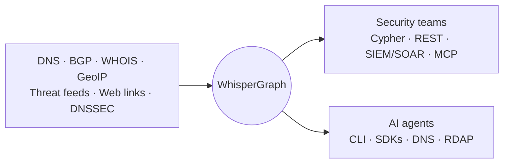

<div align="center">


# Whisper

**We index the internet's infrastructure into one live graph, then use that graph two ways:
to defend your network, and to give every AI agent on it a real, verifiable identity.**

[Website](https://www.whisper.security) &nbsp;·&nbsp;
[Docs](https://www.whisper.security/docs) &nbsp;·&nbsp;
[Console](https://console.whisper.security/sign-up) &nbsp;·&nbsp;
[X](https://x.com/WhisperSecTech) &nbsp;·&nbsp;
[LinkedIn](https://linkedin.com/company/whispersecurity/) &nbsp;·&nbsp;
[YouTube](https://www.youtube.com/@Whisper-Security)

</div>

---

Security tools see a domain, an IP, a certificate. They rarely see how those things relate, or
that the relationship changed five minutes ago. **WhisperGraph** joins DNS, routing, hosting,
WHOIS and threat intelligence into one graph, so that relationship is just a query. **Whisper
Identity** turns the same graph around: instead of asking what a domain or IP is, it asks what an
*agent* is, and answers with a real, routable IPv6 address on our own network, provable by anyone
with `dig`.

Two products, one engine. Pick where you start.

<table>
<tr>
<td width="50%" valign="top">

### WhisperGraph
*For security and threat-intel teams*

See every connection behind any domain, IP, or
network, and how it changed, in one query.

```bash
curl -s https://graph.whisper.security/api/query \
  -H 'content-type: application/json' \
  -H 'X-API-Key: whisper-<your-key>' \
  --data '{"query":
    "CALL whisper.identify([$v]) YIELD host, vendor_id, category, band",
    "parameters":{"v":"paypal.com"}}'
```

Free key: [console.whisper.security](https://console.whisper.security/sign-up)
&middot; a handful of read procedures (`whisper.assess`, `.identify`, `.variants`, `.history`...)
answer **keyless**, up to a small taste cap, no signup at all.

**Start here:** [whisper-graph-mcp](https://github.com/whisper-sec/whisper-graph-mcp) &middot;
[docs](https://www.whisper.security/docs/cypher-query-guide)

</td>
<td width="50%" valign="top">

### Whisper Identity
*For anyone building or running AI agents*

Give any agent a real, routable IPv6 `/128` it
egresses from. No shared IPs, no anonymous traffic.

```bash
curl -fsSL https://get.whisper.online | sh
whisper connect
dig -x <the /128 it just printed>   # reverse-DNS -> its identity
```

Free key: [console.whisper.security](https://console.whisper.security/sign-up)
&middot; verification (`whisper verify`, RDAP, reverse-DNS) is **keyless** for everyone, always,
by design.

**Start here:** [whisper-cli](https://github.com/whisper-sec/whisper-cli) &middot;
[nic.whisper.online](https://nic.whisper.online)

</td>
</tr>
</table>

## WhisperGraph

A custom graph engine built from first principles for internet infrastructure: **7.4B+ nodes**
across **39 entity types** and **39.3B+ relationships**, updated continuously, queried in
milliseconds, with no fixed traversal depth.

- **DNS** - 12B+ resolution edges, including historical state
- **BGP & routing** - 116K+ ASNs, 2.5M+ prefixes, streamed continuously, never a daily snapshot
- **GeoIP** - 54K+ cities across 424 countries
- **WHOIS** - organization, registrar, and contact records
- **Threat intelligence** - 43 live feeds, every verdict shipped with its evidence chain
- **Web** - 10.9B+ hyperlinks between sites
- **DNSSEC** and time-travel queries over how infrastructure looked at any point in the past



**What makes it different**

| | |
|---|---|
| **Zero-GC architecture** | No garbage-collection pauses, predictable millisecond latency at billion-node scale |
| **Native graph types** | IPv4, IPv6, CIDR, and ASN are first-class, not strings, so range and containment queries are instant |
| **Real-time ingestion** | Continuous BGP and DNS streaming, not daily snapshots |
| **Explainable scoring** | Every risk score ships with its complete evidence chain, grounded in information theory, not a black box |

## Whisper Identity

Shared IPs and bearer tokens make agent traffic anonymous by default: one leaked key, no
attribution, no way to revoke a single agent without breaking the rest. Whisper Identity gives
every agent an address instead: a real IPv6 `/128`, RIPE-allocated and RPKI-signed on our own
network (**AS219419**), DNSSEC-signed and DANE-pinned, so *the address is the identity* - anyone
can prove who it is with `dig`, `whois`, and public [RDAP](https://rdap.whisper.online), no
account, no shared secret.

It is two-tier by design, [Postel's Law](https://www.ietf.org/rfc/rfc761.txt) applied to identity:
**keyless**, anyone can verify any agent's identity is real. **With your key**, you provision
agents, set per-agent resolver policy, read logs, revoke, and route egress through the address, in
three modes depending on how much of the host you want to hand over:

| Tier | How | Best for |
|---|---|---|
| **Routed (WireGuard)** | A tunnel sources all of a host's traffic from its `/128` | Full attribution, no code change |
| **Egress proxy (SOCKS5 / HTTP CONNECT)** | Point one client at a local proxy | Per-process, drop-in |
| **Resolver only (DoH / `:53`)** | Point DNS at Whisper, apply policy at resolution | Zero footprint, policy without egress |

```bash
curl -fsSL https://get.whisper.online | sh   # one static binary, signed, no deps
whisper connect                              # provision + bring up egress from a real /128
whisper verify <any-address-or-fqdn>         # keyless: is this a real Whisper agent, and whose?
```

## Every way to build

Every quickstart on this page, and in the repos below, is one we've run against the live
network ourselves, not a stub waiting on a v2.

**Core platform**

| Repository | What it is |
|---|---|
| [whisper-cli](https://github.com/whisper-sec/whisper-cli) | The official CLI: one static binary, a scriptable Cobra command set, and a full-screen TUI |
| [whisper-graph-mcp](https://github.com/whisper-sec/whisper-graph-mcp) | Open-source, self-hostable MCP server for WhisperGraph (TypeScript, Apache-2.0) |
| [whisper-operator](https://github.com/whisper-sec/whisper-operator) | Kubernetes operator: one label gives a pod a real IPv6 identity, zero privileges, fail-open |
| [whisper-catalog](https://github.com/whisper-sec/whisper-catalog) | The portable query catalog, every graph query as one provenance-backed `catalog.json` |
| [setup-whisper](https://github.com/whisper-sec/setup-whisper) | GitHub Action: install the CLI, optionally connect an agent, in CI |
| [homebrew-tap](https://github.com/whisper-sec/homebrew-tap) &middot; [scoop-bucket](https://github.com/whisper-sec/scoop-bucket) | Package channels for the CLI on macOS/Linux and Windows |

**SDKs**

| Repository | What it is |
|---|---|
| [whisper-node](https://github.com/whisper-sec/whisper-node) | `npm i whisper-id` - identity + egress for any Node agent |
| [whisper-py](https://github.com/whisper-sec/whisper-py) | `pip install whisper-id` - identity + egress for any Python agent |
| [whisper-edge](https://github.com/whisper-sec/whisper-edge) | Dependency-free SDK for serverless/edge (Cloudflare Workers, Vercel, Deno, Netlify, Lambda, Supabase) |
| [whisper-examples](https://github.com/whisper-sec/whisper-examples) | Working examples of `whisper-edge` on every runtime above |

**Agent frameworks & workflow automation**

| Repository | What it is |
|---|---|
| [whisper-adapters](https://github.com/whisper-sec/whisper-adapters) | One command gives Claude Code, Gemini CLI, Antigravity, Codex, or Copilot CLI a Whisper identity |
| [whisper-n8n](https://github.com/whisper-sec/whisper-n8n) | n8n community node: provision and govern agent identities, plus 29 graph recipes, as native operations |
| [dify-plugin](https://github.com/whisper-sec/dify-plugin) | Dify tool plugin, live on the Dify Marketplace: keyless verify plus the full control plane |

**Browser & threat intelligence**

| Repository | What it is |
|---|---|
| [whisper-guard](https://github.com/whisper-sec/whisper-guard) | Browser extension (MV3): on-device look-alike detection plus a live graph verdict on every site |
| [whisper-opencti](https://github.com/whisper-sec/whisper-opencti) | OpenCTI connector: pivot any observable through the graph, ingest results as STIX 2.1 |
| [STIX](https://github.com/whisper-sec/STIX) | A complete Java implementation of STIX 2.1 for cyber threat intelligence sharing |
| [visual-confusables](https://github.com/whisper-sec/visual-confusables) | Font-grounded visual confusables: the codepoint pairs that render identically in real browser fonts |

## Integrate

WhisperGraph reaches your existing stack three ways: a **REST + Cypher API** for direct
programmatic access, **SIEM/SOAR connectors** for Splunk, Microsoft Sentinel, OpenCTI, and Cortex
XSOAR, and **MCP**, so any MCP-capable client (Claude, Cursor, VS Code, Windsurf, and any agent
built on [whisper-adapters](https://github.com/whisper-sec/whisper-adapters)) can query it as a
tool.

## About us

Whisper was founded in January 2025 out of Antler's fall 2024 program, selected from the top
0.4% of more than 8,000 startups, by **Kaveh Ranjbar** (Co-Founder & CEO, 25-year
internet-infrastructure veteran and former RIPE NCC CIO) and **Soroush Rafiee Rad**
(Co-Founder & CPSO, mathematician with dual PhDs in mathematical logic and the philosophy of
science). The company raised €1.6M in pre-seed capital from Antler, Atlas SGR, Volve Capital,
D11z Ventures, and Tioga Trust, and is advised by former ICANN Chairman Maarten
Botterman and APNIC Chief Scientist Geoff Huston.

We believe that understanding the internet's infrastructure, and being able to prove your place
on it, is the key to defending it.

## Resources

| | |
|---|---|
| Website | [whisper.security](https://www.whisper.security) |
| Agent identity platform | [whisper.online](https://whisper.online) |
| Docs | [whisper.security/docs](https://www.whisper.security/docs) |
| Identity platform reference | [nic.whisper.online](https://nic.whisper.online) |
| Console (free API key) | [console.whisper.security](https://console.whisper.security/sign-up) |
| llms.txt | [whisper.security/llms.txt](https://www.whisper.security/llms.txt) |
| Contact | [whisper.security/contact-us](https://www.whisper.security/contact-us) |
| Support | support@whisper.security |

## Security

If you discover a security vulnerability in any of our repositories, email
**security@whisper.security**. We take security seriously and respond promptly to every report.

## License

Licensing is specified per repository, see each repository's `LICENSE` file.
